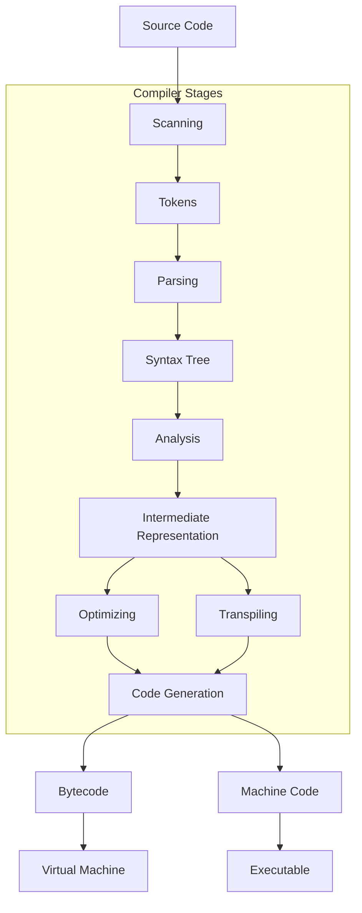
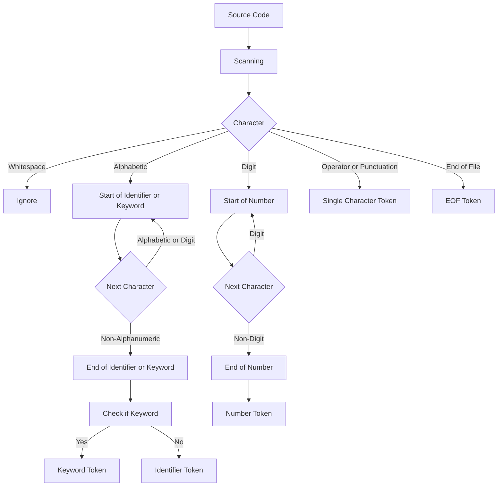

# Compiler Project

We will be proceeding with C++
using an automated test framework as we develop.

* Guides for Compiler/Interpreter Design
  - [Crafting Interpreters](https://timothya.com/pdfs/crafting-interpreters.pdf)
  - [Crafting a Compiler in Rust](https://dev.to/simmypeet/crafting-a-compiler-in-rust-syntactic-analysis-5dia)
  - [Rust Compiler Tutorial Series](https://www.youtube.com/watch?v=GAU51Dqsp3Y&list=PLI1h1vRqlHLNZAa2BEM9uZ2GEvUNYDasO)
  - [Writing a Program Language in Rust](https://www.youtube.com/watch?v=WpOivQLjhJA&list=PLj_VrUwyDuXS4K3n7X4U4qmkjpuA8rJ76)

* General Information and Theoretically Oriented Textbooks  
  - [Computer Systems: A Programmer's Perspective](https://annas-archive.org/md5/ebb9004fe72f0da390bdef45026b2786)
  - [Introduction to Compilers and Language Design](https://www3.nd.edu/~dthain/compilerbook/compilerbook.pdf)

* Decisions to make for language design
  - Static vs dynamic typing
  - Garbage collection vs no garbage collection
  - Language Inspiration (What languages do we want to use for inspiration?)

* First Steps:
  1) Background Info (Judah)
  2) Rust Documentation (Judah and Jaanhvi)
  3) Choosing a Rust compiler tutorial (Of the two tutorials) (Jaanhvi)
  4) Following a Rust compiler tutorial (Judah and Jaanhvi)

## Compiler Stages

## Detailed Lexical Analysis

### Notes
A scanner (or lexer) takes in the linear stream of characters and chunks them together into a series of something more akin to "words". In programming languages, each of these words is called a token. Some tokens are single characters, like `(` and `,`. Others may be several characters long, like numbers (123), string literals ("hi!"), and identifiers (min).

