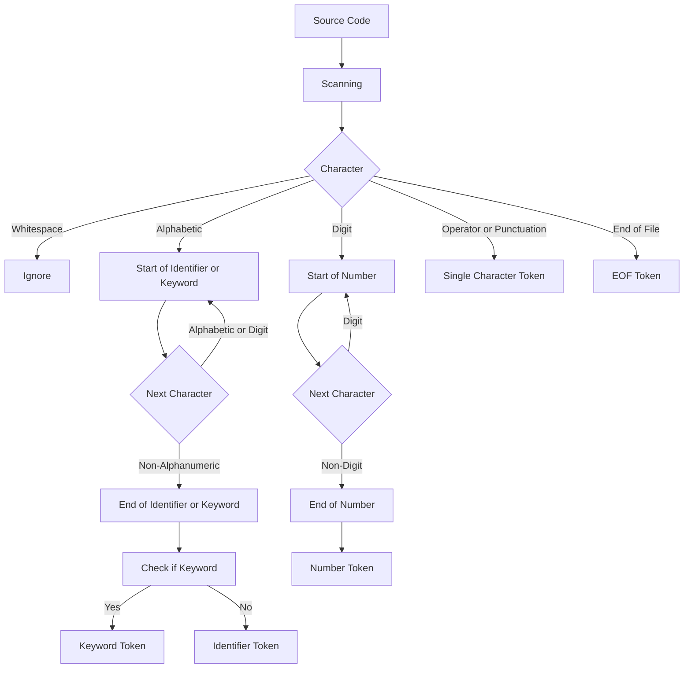

# Detailed Lexical Analysis

## Notes
A scanner (or lexer) takes in the linear stream of characters and chunks them together into a series of something more akin to "words". In programming languages, each of these words is called a token. Some tokens are single characters, like `(` and `,`. Others may be several characters long, like numbers (123), string literals ("hi!"), and identifiers (min).

